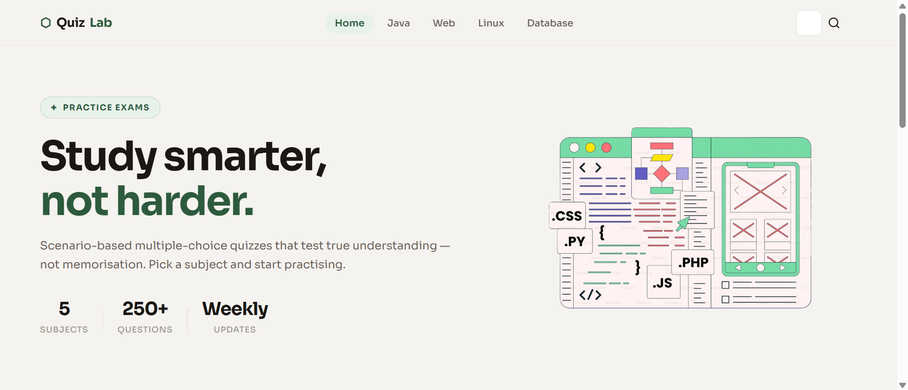
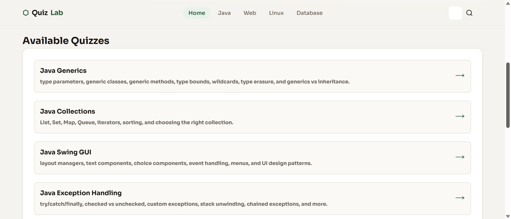
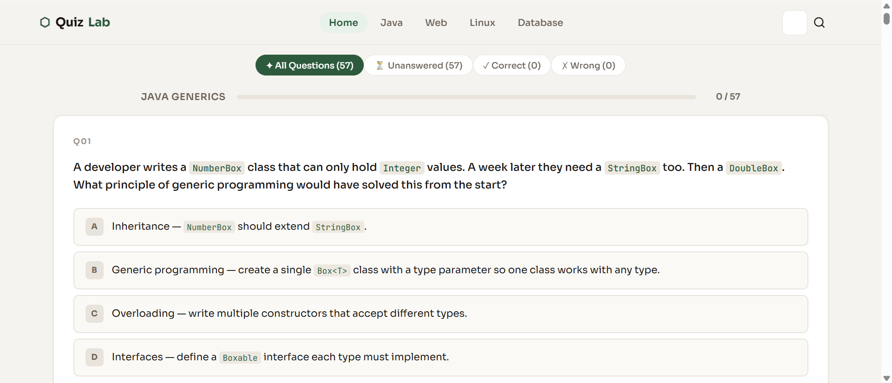

# Quiz App 📚

A full-stack web application designed to test student understanding of course material through interactive quizzes. Built with modern web technologies to provide a seamless and responsive learning experience.

## 🌟 Features

- **User Authentication & Management** - Secure user registration and login system
- **Subject Management** - Organize quizzes by subject or topic
- **Interactive Quizzes** - Take multiple-choice or short-answer quizzes
- **Real-time Quiz Scoring** - Instant feedback on quiz completion
- **Responsive Design** - Works seamlessly on desktop and mobile devices
- **Data Persistence** - All user progress and quiz results stored in MongoDB

## 🛠️ Tech Stack

### Backend
- **Node.js** - JavaScript runtime environment
- **Express.js** - Web application framework
- **MongoDB** - NoSQL database for data persistence
- **Mongoose** - MongoDB object modeling toolkit
- **dotenv** - Environment variable management

### Frontend
- **Pug** - Server-side templating engine
- **CSS** - Styling and responsive design
- **JavaScript** - Client-side interactivity

## 📋 Project Structure

```
quiz-app/
├── app.js                 # Main application entry point
├── package.json          # Project dependencies and scripts
├── .env                  # Environment variables (not included in repo)
│
├── routes/               # API route handlers
│   ├── homeRouter.js     # Home page routes
│   ├── subjectsRouter.js # Subject management routes
│   ├── quizRouter.js     # Quiz functionality routes
│   └── userRouter.js     # User authentication & profile routes
│
├── models/               # Mongoose database schemas
│   ├── user.js          # User schema and model
│   └── subject.js       # Subject schema and model
│
├── views/               # Pug template files
│   └── *.pug           # HTML templates
│
├── public/             # Static assets
│   ├── css/           # Stylesheet files
│   ├── js/            # Client-side JavaScript
│   └── images/        # Image assets
│
├── data/              # Static data files (if any)
└── scripts/           # Utility scripts
```

## 🚀 Getting Started

### Prerequisites
- Node.js (v14 or higher)
- npm or yarn package manager
- MongoDB Atlas account (or local MongoDB instance)

### Installation

1. **Clone the repository**
   ```bash
   git clone https://github.com/jiaying-chen-teyura/Quiz-Web-Application.git
   cd quiz-app
   ```

2.  **Start the application**
   ```bash
   npm start
   ```
   The server will run on `http://localhost:3000`

## 📖 API Endpoints

### Home Routes
- `GET /` - Home page

### User Routes
- `POST /users/register` - Register a new user
- `POST /users/login` - User login
- `GET /users/profile` - Get user profile
- `PUT /users/profile` - Update user profile

### Subject Routes
- `GET /subjects` - Get all subjects
- `GET /subjects/:id` - Get subject details
- `POST /subjects` - Create new subject (admin)
- `PUT /subjects/:id` - Update subject (admin)
- `DELETE /subjects/:id` - Delete subject (admin)

### Quiz Routes
- `GET /quizzes` - Get all quizzes
- `GET /quizzes/:id` - Get quiz details
- `POST /quizzes/:id/submit` - Submit quiz answers
- `GET /quizzes/:id/results` - Get quiz results

## 💾 Database Models

### User Model
```javascript
{
  name: String,
  email: String,
  password: String (hashed),
  createdAt: Date,
  quizzes: [QuizResult]
}
```

### Subject Model
```javascript
{
  name: String,
  description: String,
  quizzes: [Quiz],
  createdAt: Date
}
```

## 🔧 Configuration

All configuration is managed through environment variables in the `.env` file:

| Variable | Description | Example |
|----------|-------------|---------|
| `MONGO_URI` | MongoDB connection string | `mongodb+srv://...` |
| `PORT` | Server port | `3000` |
| `NODE_ENV` | Environment mode | `development` or `production` |

## 🎯 How to Use

1. **Register/Login** - Create an account or log in with existing credentials
2. **Browse Subjects** - View available subjects and their associated quizzes
3. **Take a Quiz** - Select a quiz and answer the questions
4. **View Results** - Get instant feedback and see your score
5. **Track Progress** - Monitor your quiz history and improvements

## 📊 Screenshots



## 🧪 Testing


## 👤 Author

**chinkitsune**
- GitHub: [@chinkitsune](https://github.com/chinkitsune)

## 📄 License

This project is open source and available under the MIT License.

## 🤝 Contributing

Contributions are welcome! To contribute:

1. Fork the repository
2. Create your feature branch (`git checkout -b feature/AmazingFeature`)
3. Commit your changes (`git commit -m 'Add some AmazingFeature'`)
4. Push to the branch (`git push origin feature/AmazingFeature`)
5. Open a Pull Request

## 🙏 Acknowledgments

- Express.js community for excellent documentation
- MongoDB for reliable database services
- All contributors and users who have provided feedback

---

**Last Updated:** May 7, 2026
